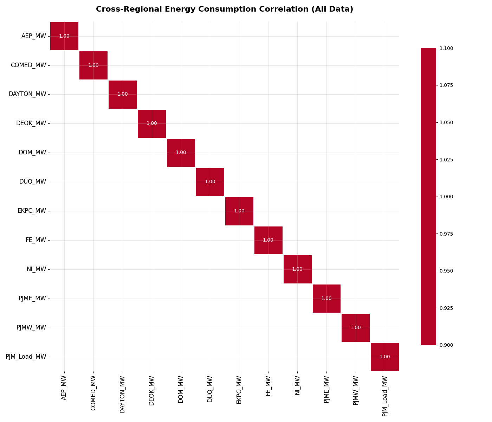
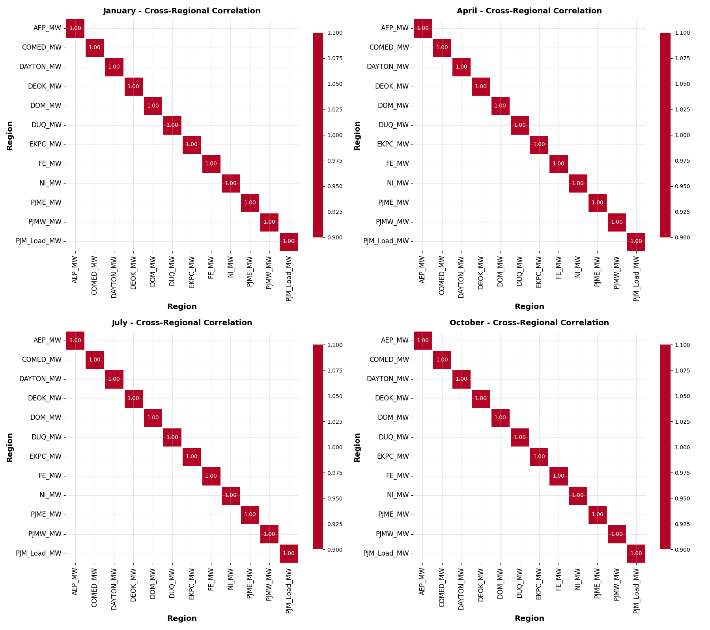
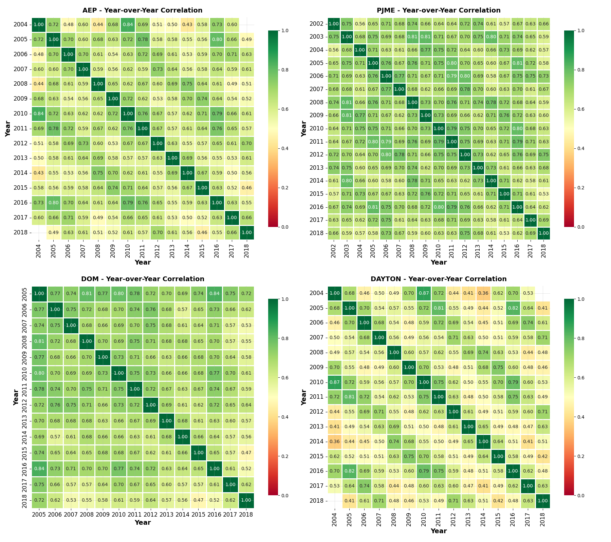
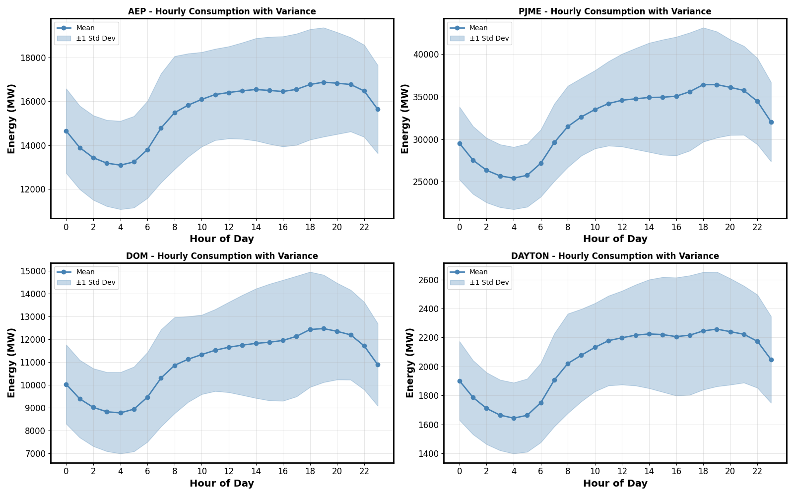
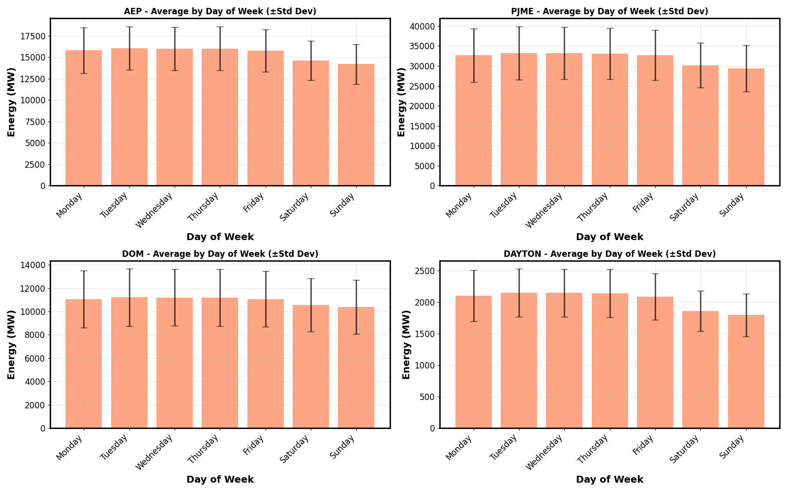
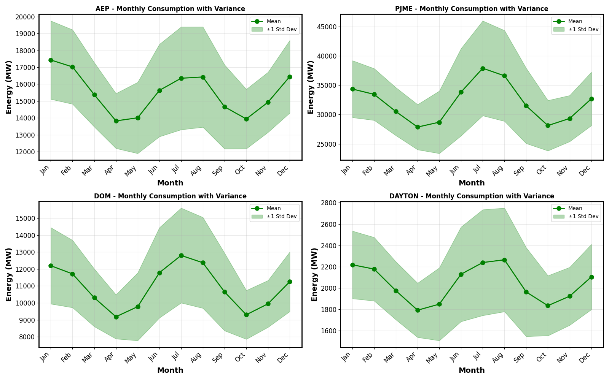
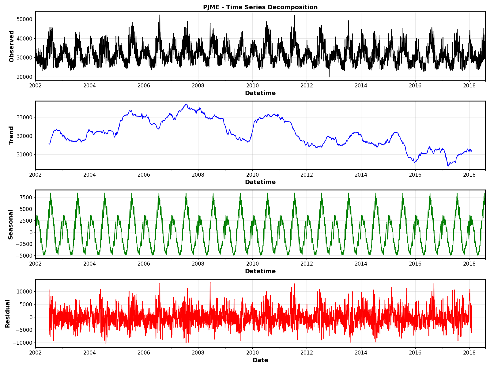
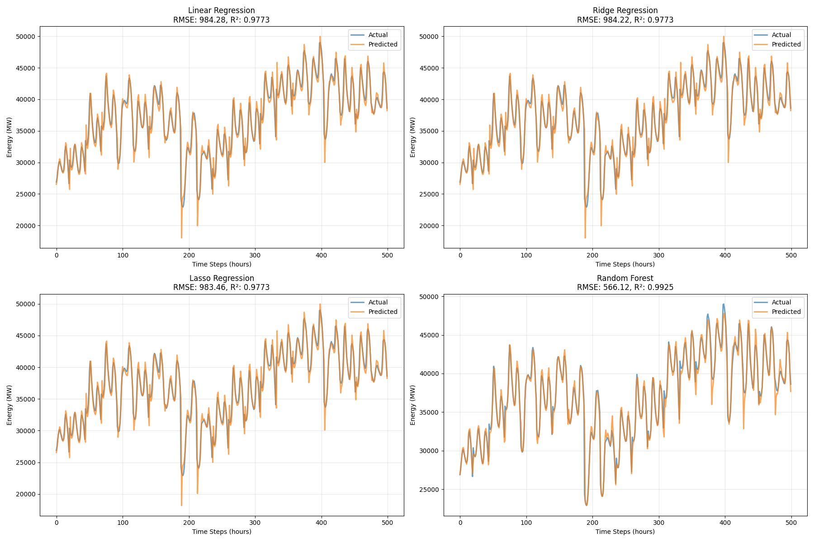
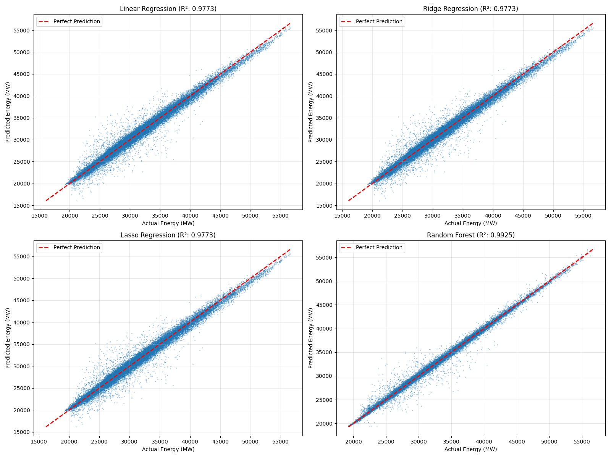
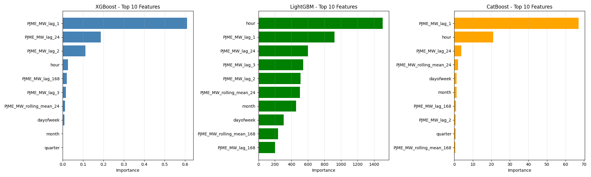

# Energy Consumption Analysis

This document presents a comprehensive analysis of the hourly energy consumption dataset. The analysis covers data exploration, correlation studies, statistical pattern analysis, and the implementation of both traditional and state-of-the-art forecasting models.

## 1. Initial Data Exploration

The dataset contains hourly energy consumption data for 13 different regions across the United States, spanning from 1998 to 2018.

### Regional Energy Consumption

A preliminary visualization of the energy consumption for each region reveals distinct patterns and scales of energy usage.

*Figure 1: Time series plots of hourly energy consumption for various US regions.*

## 2. Correlation Analysis

### 2.1. Cross-Regional Correlation

A heatmap of the correlation between the energy consumption of different regions shows how demand is related across the country.

*Figure 2: Heatmap showing the correlation of monthly average energy consumption between different regions.*

The analysis was also performed on a month-by-month basis to capture seasonal variations in correlation.

*Figure 3: Heatmaps showing cross-regional correlation for January, April, July, and October.*

### 2.2. Year-over-Year Correlation

To understand the stability of consumption patterns over time, a year-over-year correlation was performed for each region.

*Figure 4: Heatmaps showing the year-over-year correlation for selected regions (AEP, PJME, DOM, DAYTON).*

## 3. Statistical Pattern Analysis

### 3.1. Consumption Patterns

- **Hourly Patterns**: Energy consumption follows a clear diurnal cycle, with peaks in the evening and troughs in the early morning.
- **Daily Patterns**: Weekdays consistently show higher energy consumption than weekends, a finding supported by t-tests.
- **Seasonal Patterns**: Consumption is highest in the summer and winter months, corresponding to heating and cooling demands.

*Figure 5: Average hourly energy consumption with ±1 standard deviation for selected regions.*

*Figure 6: Average daily energy consumption with error bars for selected regions.*

*Figure 7: Average monthly energy consumption with ±1 standard deviation for selected regions.*

### 3.2. Time Series Decomposition

Decomposing the time series for the PJME region reveals a long-term trend, a strong yearly seasonality, and the underlying residual component.

*Figure 8: Time series decomposition of PJME energy consumption into observed, trend, seasonal, and residual components.*

## 4. Shallow Learning Models

Several traditional machine learning models were trained to predict energy consumption for the PJME region. Features included temporal information, lag values, and rolling means.

### Model Performance

| Model             | RMSE      | MAE     | R²      |
|-------------------|-----------|---------|---------|
| Random Forest     | 566.12    | 310.25  | 0.9925  |
| Lasso Regression  | 983.46    | 651.49  | 0.9773  |
| Ridge Regression  | 984.22    | 650.53  | 0.9773  |
| Linear Regression | 984.28    | 650.42  | 0.9773  |

### Visualizations

*Figure 9: Predictions vs. actual values for the shallow learning models.*

*Figure 10: Scatter plots of predicted vs. actual values for the shallow learning models.*

## 5. Gradient Boosting Models

Advanced gradient boosting models were also evaluated, showing improved performance over the linear models.

### Model Performance

| Model    | RMSE   | MAE    | R²     |
|----------|--------|--------|--------|
| XGBoost  | 576.55 | 332.49 | 0.9922 |
| LightGBM | 613.45 | 379.34 | 0.9912 |
| CatBoost | 617.35 | 389.69 | 0.9911 |

### Feature Importance

Feature importance analysis from these models highlights the critical role of recent lag features (`PJME_MW_lag_1`) and the hour of the day.

*Figure 11: Top 10 feature importances from XGBoost, LightGBM, and CatBoost models.*

## 6. Temporal Fusion Transformer (TFT)

A state-of-the-art Temporal Fusion Transformer (TFT) was implemented for multi-horizon forecasting with uncertainty estimation.

### Predictions and Future Inference

The TFT model provides not only point forecasts but also prediction intervals, offering a measure of uncertainty. The model was used to generate a 7-day forecast beyond the available data.

*Figure 12: Sample 24-hour forecasts from the TFT model, showing prediction intervals.*

*Figure 13: A 7-day future forecast generated by the TFT model, shown with 30 days of historical context.*

### Interpretability

The TFT model's built-in interpretability allows for an analysis of variable importance and attention weights.

- **Variable Importance**: The most important features were found to be `energy` (the target variable itself, used as a historical input), `hour_cos`, and `hour_sin`.
- **Attention Weights**: The attention mechanism primarily focuses on recent historical time steps, especially those from the previous day (around the 24-hour lag).

*Figure 14: Variable importance for the TFT model's encoder and decoder.*

*Figure 15: Heatmap and line plot of the TFT model's attention weights.*

## 7. Conclusion

This analysis progressed from a broad overview of regional energy consumption to the implementation of sophisticated forecasting models. Key findings include:
- Strong daily, weekly, and seasonal patterns in energy usage.
- High correlation in consumption patterns between geographically related regions.
- The significant predictive power of recent historical (lag) values and time-of-day features.
- The superior performance of tree-based models (Random Forest, XGBoost) and the Temporal Fusion Transformer over linear models for this forecasting task.
- The TFT model not only provides accurate forecasts but also valuable insights into the model's decision-making process through its interpretability features.
