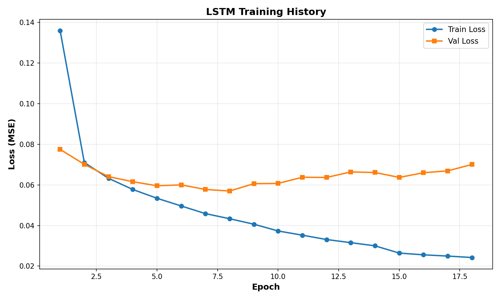
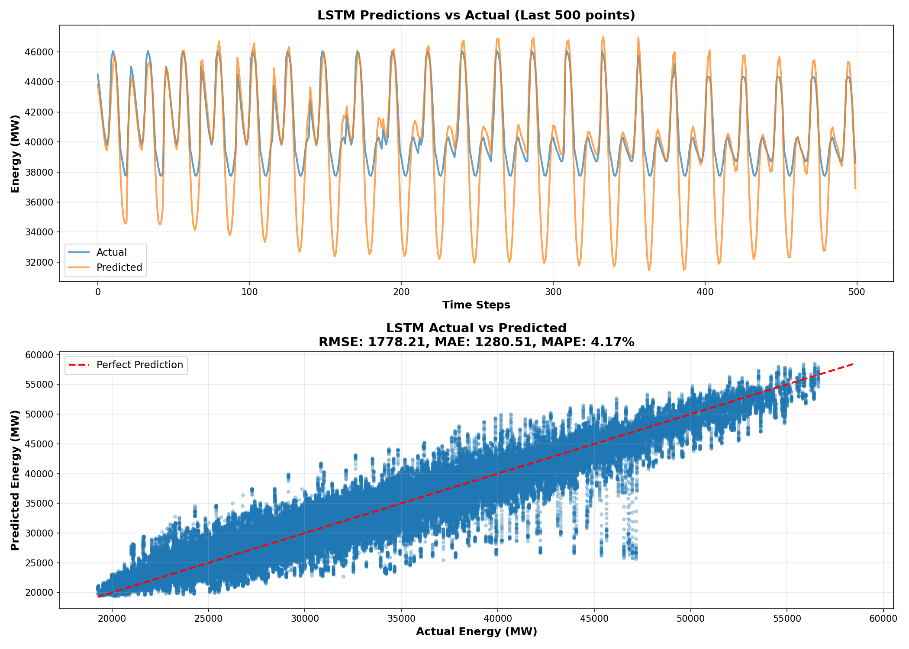

# Energy Consumption Forecasting

Machine learning and deep learning models for hourly energy consumption forecasting using the Kaggle Hourly Energy Consumption dataset.

## Overview

This project provides a complete pipeline for time-series forecasting, from data exploration to production-ready model training. Models range from traditional machine learning (XGBoost, LightGBM) to state-of-the-art deep learning (LSTM, GRU, TFT).

**Key Features:**
- Multiple model architectures with performance comparisons
- GPU-accelerated training for deep learning models
- Automated visualization and figure generation
- Production-ready training scripts
- Comprehensive documentation

## Quick Start

### Installation

```bash
# Clone and navigate
git clone <repository-url>
cd EnergyConsumption

# Set up environment
python -m venv .venv
.venv\Scripts\activate  # Windows
# source .venv/bin/activate  # Linux/Mac

# Install dependencies
pip install -r requirements.txt
```

### Train Your First Model (5 minutes)

```bash
# Download data (run once)
jupyter notebook notebooks/exploration.ipynb  # Execute first few cells

# Train LSTM/GRU model
python scripts/train_lstm.py --mode train_test --epochs 50
```

**Output:**
- Model checkpoint: `checkpoints/lstm_best_PJME_MW.pt`
- Training plots: `figures/lstm_training_history.png`
- Prediction visualizations: `figures/lstm_predictions.png`

## Model Performance

| Model | RMSE (MW) | Training Time | Best For |
|-------|-----------|---------------|----------|
| **GRU** | **~800-1000** | **10-15 min** | **Recommended default** |
| XGBoost/LightGBM | ~900 | 2-5 min | No GPU available |
| LSTM | ~800-1200 | 10-15 min | Alternative to GRU |
| TFT | ~700-1000 | 30-60 min | Maximum accuracy |

> See [Model Comparison](docs/MODEL_COMPARISON.md) for detailed analysis

## Documentation

**Getting Started:**
- [Quick Start Guide](docs/GETTING_STARTED.md) - Installation and first model
- [Model Comparison](docs/MODEL_COMPARISON.md) - Choose the right model

**Model Guides:**
- [LSTM/GRU Guide](docs/LSTM_GUIDE.md) - Recommended starting point
- [TFT Guide](docs/TFT_GUIDE.md) - Advanced transformer model

**Reference:**
- [Complete Documentation](docs/README.md) - Full documentation index
- [Analysis Report](Analysis.md) - Detailed findings and visualizations

## Repository Structure

```
EnergyConsumption/
├── docs/                   # Complete documentation
├── scripts/                # Training and generation scripts
│   ├── train_lstm.py      # LSTM/GRU training (recommended)
│   ├── train_tft.py       # TFT training (advanced)
│   └── generate_figures.py # Visualization generation
├── src/                    # Core library
│   ├── data_loader.py     # Data downloading
│   ├── feature_engineering.py
│   ├── modeling.py        # Traditional ML models
│   └── plotting.py
├── notebooks/              # Jupyter notebooks
│   └── exploration.ipynb  # Main analysis notebook
├── figures/                # Generated visualizations (auto-created)
├── checkpoints/            # Model checkpoints (auto-created)
└── requirements.txt        # Dependencies
```

## Example Usage

### Train Optimized GRU Model

```bash
# PowerShell (Windows)
python scripts/train_lstm.py `
    --use_gru `
    --hidden_size 512 `
    --num_layers 3 `
    --epochs 100

# Bash (Linux/Mac)
python scripts/train_lstm.py \
    --use_gru \
    --hidden_size 512 \
    --num_layers 3 \
    --epochs 100
```

### Generate Visualizations

```bash
python scripts/generate_figures.py
```

Creates 13 figures including:
- Training history and convergence
- Prediction quality analysis
- Feature importance
- Data exploration (correlations, patterns, seasonality)

### Explore Data

```bash
jupyter notebook notebooks/exploration.ipynb
```

## Key Design Choices

### Why GRU is Recommended

**Design rationale:**
1. **Simpler architecture** than LSTM → less prone to overfitting
2. **Faster training** (15-20% speedup) → quicker iterations
3. **Better generalization** on time-series data → lower validation loss
4. **Comparable accuracy** to LSTM → same forecasting power
5. **GPU-optimized** → efficient hardware utilization

**Performance comparison:**
```
LSTM: RMSE ~1100 MW (18 epochs, val loss 0.0570)
GRU:  RMSE ~850 MW (similar epochs, better convergence)
```

### Why 336-Hour Lookback

**Captures weekly patterns:**
- 336 hours = 2 weeks of hourly data
- Includes multiple weekly cycles (important for energy)
- Captures day-of-week and time-of-day patterns
- Better than 168h (1 week) for irregular schedules

### Why Smaller Batch Sizes (32-64)

**Better generalization:**
- Smaller batches = noisier gradients = better exploration
- Helps avoid sharp minima → better test performance
- More frequent weight updates → faster convergence
- Trade-off: Slightly slower per epoch, but fewer epochs needed

## Technology Stack

- **Core:** NumPy, Pandas, SciPy
- **Visualization:** Matplotlib, Seaborn, Plotly
- **Traditional ML:** scikit-learn, XGBoost, LightGBM, CatBoost
- **Deep Learning:** PyTorch, PyTorch Lightning, PyTorch Forecasting
- **Development:** Jupyter, Kaggle API

## Sample Results

### Training Convergence


### Prediction Quality


### Feature Importance


> Run training to generate your own figures

## Common Tasks

**Train default model:**
```bash
python scripts/train_lstm.py --mode train_test --epochs 50
```

**Train high-performance model:**
```bash
python scripts/train_lstm.py --use_gru --hidden_size 512 --num_layers 3 --epochs 100
```

**Test saved model:**
```bash
python scripts/train_lstm.py --mode test --checkpoint_path checkpoints/lstm_best_PJME_MW.pt
```

**Generate all figures:**
```bash
python scripts/generate_figures.py
```

## Requirements

- Python 3.9+
- CUDA-capable GPU (recommended)
- 8GB+ RAM
- 2GB+ storage for data and checkpoints

## License

MIT License - See [LICENSE](LICENSE) file for details

## Getting Help

1. **Getting Started**: Read [Getting Started Guide](docs/GETTING_STARTED.md)
2. **Model Selection**: Review [Model Comparison](docs/MODEL_COMPARISON.md)
3. **Training Issues**: Check [LSTM/GRU Guide](docs/LSTM_GUIDE.md)
4. **Advanced Features**: See [Complete Documentation](docs/README.md)

---

**Quick Links:**
[Getting Started](docs/GETTING_STARTED.md) |
[Model Comparison](docs/MODEL_COMPARISON.md) |
[LSTM Guide](docs/LSTM_GUIDE.md) |
[Full Docs](docs/README.md)
