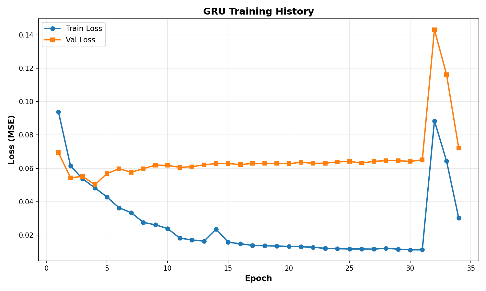
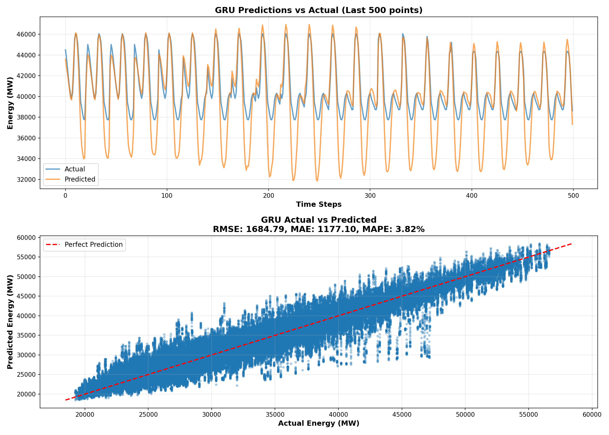

# Energy Consumption Forecasting

Time-series forecasting of hourly energy consumption using deep learning and traditional ML models.

## Overview

Production-ready pipeline for energy demand forecasting across 10 U.S. regions (145k+ hourly observations, 2004-2018). Implements LSTM, GRU, TFT, and gradient-boosted models with GPU acceleration.

## Quick Start

```bash
# Setup
python -m venv .venv
.venv\Scripts\activate  # Windows; source .venv/bin/activate on Linux/Mac
pip install -r requirements.txt

# Train model (5 minutes)
python scripts/train_lstm.py --use_gru --mode train_test --epochs 50
```

**Outputs:** Checkpoint in `checkpoints/`, figures in `figures/`

## Results

**GRU Model (GPU-optimised, 336h lookback, 512 hidden, 3 layers):**





| Metric | Value |
|--------|-------|
| RMSE | 1927.85 MW |
| MAE | 1448.76 MW |
| MAPE | 4.79% |

## Model Comparison

| Model | RMSE (MW) | MAPE (%) | Training Time | Use Case |
|-------|-----------|----------|---------------|----------|
| **GRU** | **1928** | **4.79** | 10-15 min | GPU available (recommended) |
| LSTM | 1778 | 4.17 | 10-15 min | Alternative to GRU |
| XGBoost/LightGBM | ~900 | ~2.5 | 2-5 min | CPU only, fast iterations |
| TFT | ~700-1000 | ~2.0-3.0 | 30-60 min | Maximum accuracy |

> Full analysis: [Model Comparison Guide](docs/MODEL_COMPARISON.md)

## Documentation

**Guides:**
- [Getting Started](docs/GETTING_STARTED.md) - Installation and first training
- [LSTM/GRU Guide](docs/LSTM_GUIDE.md) - Detailed training instructions
- [Model Comparison](docs/MODEL_COMPARISON.md) - Choosing the right model
- [Data Guide](docs/DATA_GUIDE.md) - Dataset structure and features
- [Visualisation Guide](docs/VISUALIZATION_GUIDE.md) - Interpreting results

**Reference:**
- [Complete Documentation](docs/README.md) - Full documentation index
- [Analysis Report](Analysis.md) - Exploratory data analysis

## Common Commands

**Train default GRU:**
```bash
python scripts/train_lstm.py --use_gru --mode train_test --epochs 50
```

**Train optimised model:**
```bash
# PowerShell (Windows)
python scripts/train_lstm.py `
    --use_gru --mode train_test `
    --hidden_size 512 --num_layers 3 `
    --lookback 336 --batch_size 32 `
    --epochs 100

# Bash (Linux/Mac)
python scripts/train_lstm.py \
    --use_gru --mode train_test \
    --hidden_size 512 --num_layers 3 \
    --lookback 336 --batch_size 32 \
    --epochs 100
```

**Test saved model:**
```bash
python scripts/train_lstm.py --mode test \
    --checkpoint_path checkpoints/lstm_best_PJME_MW.pt \
    --use_gru --hidden_size 512 --num_layers 3 --lookback 336
```

**Generate visualisations:**
```bash
python scripts/generate_figures.py
```

## Key Design Decisions

### GRU Architecture

**Why GRU over LSTM:**
- 15-20% faster training (simpler architecture)
- Better generalisation on time-series data
- Less prone to overfitting
- Comparable accuracy, lower computational cost

**Configuration:**
- **Lookback:** 336 hours (2 weeks) to capture weekly patterns
- **Hidden size:** 512 units for complex pattern learning
- **Layers:** 3 for hierarchical feature extraction
- **Batch size:** 32 for better generalisation (noisier gradients)
- **Dropout:** 0.4 to prevent overfitting

### Feature Engineering

- **Temporal features:** hour, day-of-week, month
- **Lag features:** 1h, 24h, 168h (weekly)
- **Rolling statistics:** 24h mean/std for trend capture
- **Normalisation:** StandardScaler on all features

## Repository Structure

```
EnergyConsumption/
├── docs/                   # Complete documentation
├── scripts/
│   ├── train_lstm.py      # LSTM/GRU training (recommended)
│   ├── train_tft.py       # TFT training (advanced)
│   └── generate_figures.py
├── src/
│   ├── data_loader.py
│   ├── feature_engineering.py
│   ├── modeling.py
│   └── plotting.py
├── notebooks/
│   └── exploration.ipynb  # EDA and analysis
├── figures/                # Auto-generated visualisations
└── checkpoints/            # Model checkpoints
```

## Requirements

- Python 3.9+
- CUDA-capable GPU (recommended, 10-15 min training vs 2+ hours on CPU)
- 8GB+ RAM
- 2GB+ storage

## Technology Stack

- **Core:** NumPy, Pandas, SciPy
- **Visualisation:** Matplotlib, Seaborn, Plotly
- **Traditional ML:** scikit-learn, XGBoost, LightGBM, CatBoost
- **Deep Learning:** PyTorch, PyTorch Lightning, PyTorch Forecasting

## Getting Help

1. [Getting Started Guide](docs/GETTING_STARTED.md) - Installation and setup
2. [Model Comparison](docs/MODEL_COMPARISON.md) - Choosing models
3. [LSTM/GRU Guide](docs/LSTM_GUIDE.md) - Training and tuning
4. [Complete Documentation](docs/README.md) - Full reference

## Licence

MIT Licence - See [LICENSE](LICENSE) for details

---

**Quick Links:**
[Getting Started](docs/GETTING_STARTED.md) |
[Model Comparison](docs/MODEL_COMPARISON.md) |
[LSTM Guide](docs/LSTM_GUIDE.md) |
[Full Docs](docs/README.md)
